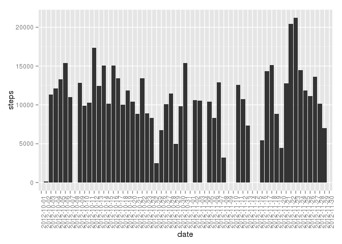
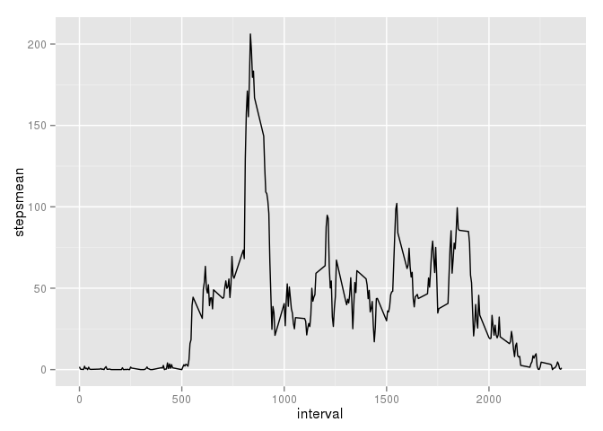
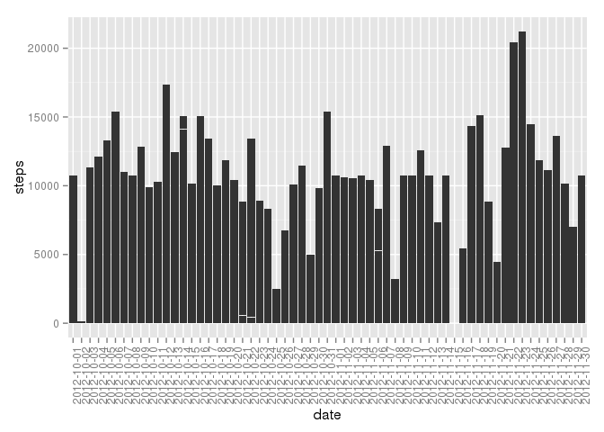
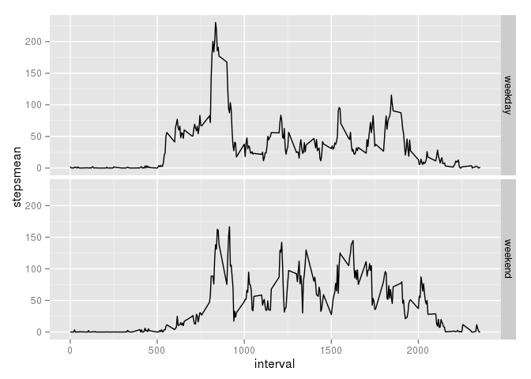

# Reproducible Research Peer Assignment 1
Jorg Bliesener  
23-10-2014  

This is the R markdown document for the first Peer Assignment in the Coursera "Reproducible Research" course.

## Installing and loading required libraries

First, we have to load the required libraries. Some of them might not be installed on our system, so we check this and install them if required. 

The following code was used already in the "Getting and Cleaning Data course".


```r
listOfPackages <- c("ggplot2", "plyr")

# find packages that need to be installed
newPackages <- listOfPackages[!(listOfPackages %in% installed.packages()[,"Package"])]
if (length(newPackages) != 0) install.packages(newPackages)

# load libraries from list
libraries<-lapply(listOfPackages,function(x){library(x,character.only=T)})
```

## Loading and preprocessing the data 

The data is provided in the file "activity.zip". While it would be desirable to 
embed it into this markdown file, creating a single document with data and code,
I haven't found a way how this could be done. Therefore, we read the data from
the zipped file:


```r
zipfile<-"activity.zip"
data<-read.csv(unz("activity.zip","activity.csv"))
```

## What is mean total number of steps taken per day?

We want to calculate the total number of steps taken per day. The instructions 
tell us to ignore missing data and to produce a "histogram". 

Actually, there are two ways to produce this histogram, one is straightforward,
while the other one requires aggregation in a separate step.

This one is straightforward, but produces some warnings and the histogram looks
as if it had "stacked" bars in some positions.


```r
ggplot(data=data, aes(x=date, y=steps)) + 
        geom_bar(stat="identity") + 
        theme(axis.text.x=element_text(angle=90, hjust=1))
```

```
## Warning: Removed 2304 rows containing missing values (position_stack).
```

 

The other method requires some aggregation of the data with ddply before plotting 
and sets all days with missing data to "0".


```r
dailyData <- ddply(data, .(date), colwise(sum), na.rm=T)
ggplot(data=dailyData, aes(x=date, y=steps)) +
        geom_bar(stat="identity") +
        theme(axis.text.x=element_text(angle=90, hjust=1))
```

 

To calculate mean and median, we again aggregate the data, however, this time
we do **NOT** ignore the missing data in the aggregation step. Instead we ignore
them when calculating the mean. The difference is that when we ignore them during
preprocessing, we consider days with missing data as "0". This is fine for 
our histogram, but it does not reflect the reality for mean and median calculation.


```r
dailyData2 <- ddply(data, .(date), colwise(sum))
mean1 <- mean(dailyData2$steps, na.rm=T)
median1 <- median(dailyData2$steps, na.rm=T)
```

This gives us a `mean1` of 10766.19 and a `median1` of 10765.

Note the difference if we use the preprocessed dailyData:


```r
mean2 <- mean(dailyData$steps)
median2 <- median(dailyData$steps)
```

Here, `mean2` is 9354.23 and a `median2` is 10395,
as there are days with 0 steps, due to the `na.rm=T` that was used when dailyData
was generated.

So, always think **before** how you will treat NAs.

## What is the average daily activity pattern?

In order to answer this question, we're going to aggregate over the days and look
at the average for each time interval over all days. This is just another `ddply`
operation. Then we plot the result as a line plot. Instead of using `plot` with
`type="l"`, I prefer ggplot.


```r
intervalData <- ddply(data, .(interval), summarize, stepsmean=mean(steps, na.rm=T))
ggplot(data=intervalData, aes(x=interval, y=stepsmean)) + geom_line()
```

 

To find the interval that on average has the highest number of steps, we simply
take the maximum value of the `intervalMeans$stepsmean` column:


```r
maxSteps <- max(intervalData$stepsmean)
maxInterval <- intervalData[intervalData$stepsmean==maxSteps,]$interval
```

From this diagram, we can see that the interval that on average has the highest
number of steps (206.1698113) is interval number 
835, which corresponds to the five-minute interval starting at 
08:35 h (in 24h format).

## Imputing missing values

For some of the days, no data is available. We can discover the number of days


```r
linesMissing <- sum(is.na(data))
daysWithoutData <- unique(data[is.na(data$steps),]$date)
numberOfDaysWithoutData <- length(daysWithoutData)
print(linesMissing)
```

```
## [1] 2304
```

```r
print(numberOfDaysWithoutData)
```

```
## [1] 8
```

So, we have 8 days that have some data missing and a 
total of 2304 intervals without data. As each day has 288 
five-minute intervals, we see that 8 days are **completely** 
missing. These days are: 2012-10-01, 2012-10-08, 2012-11-01, 2012-11-04, 2012-11-09, 2012-11-10, 2012-11-14, 2012-11-30.

For those days, we use the average of all of the other days. In the previous step,
we've calculated this data and we now fill it in for the days that have no data.


```r
# copy only the valid days to a new dataset
newData <- data[!is.na(data$steps),]

# add averaged data for each day with missing data
for (day in daysWithoutData) {
        
        ## copy averaged data and add day column
        dfNew <- data.frame(intervalData$stepsmean, day, intervalData$interval)
        names(dfNew) <- names(newData)
        
        # add to exising data frame
        newData <- rbind(newData, dfNew)
}

# finally, sort the data frame by date and interval. Just to help the user...
newData<-newData[order(newData$date,newData$interval),]
```

So, this gives us the following bar plot (no need to worry about NAs anymore):


```r
ggplot(data=newData, aes(x=date, y=steps)) + 
        geom_bar(stat="identity") + 
        theme(axis.text.x=element_text(angle=90, hjust=1))
```

 

Again, these strange *stacked* bars appear. Aggregating the data, we can get rid
of them:


```r
newDailyData <- ddply(newData, .(date), colwise(sum))
ggplot(data=newDailyData, aes(x=date, y=steps)) + 
        geom_bar(stat="identity") + 
        theme(axis.text.x=element_text(angle=90, hjust=1))
```

 

Calculating mean and median:


```r
mean3 <- mean(newDailyData$steps)
median3 <- median(newDailyData$steps)
print(mean3)
```

```
## [1] 10766.19
```

```r
print(median3)
```

```
## [1] 10766.19
```

If we fill in the missing data with the mean of the remaining days, the total 
mean doesn't change. This is obvious. On the other hand, the median **DOES** 
change, as now there are 8 more days that have a total
number of steps equal to 10766.19. 

## Are there differences in activity patterns between weekdays and weekends?

To answer this question, we first must identify weekdays and weekends. The wday
component of the POSIXlt class helps us with that:


```r
wday<-as.POSIXlt(newData$date)$wday
dayType<-factor(wday==0 | wday==6, labels=c("weekday","weekend"))
newData<-cbind(newData,dayType)
```

We now calculate and plot the interval data separately for weekdays and weekends. 


```r
intervalData2 <- ddply(newData, .(interval, dayType), summarize, stepsmean=mean(steps))
ggplot(data=intervalData2, aes(x=interval, y=stepsmean)) + 
        geom_line() + 
        facet_grid(dayType ~ . )
```

 

So, we see some change in behaviour on the weekend:

- the user tends to get up later
- the 8:30 peak is much lower
- there seems to be more activity during the day on weekends
